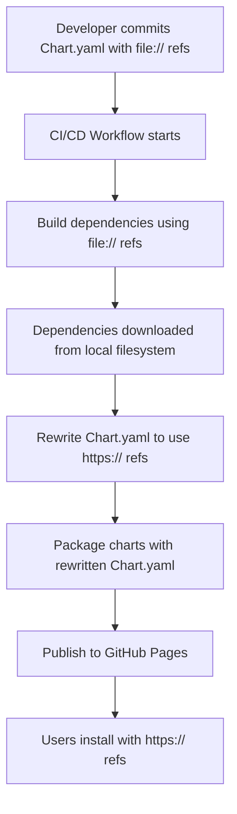

# Conditional Dependency References for Helm Charts

## Problem Statement

When you have Helm charts that depend on other charts in the same repository, you face a **circular dependency problem** during releases:

```yaml
# hyperswitch-stack/Chart.yaml
dependencies:
  - name: hyperswitch-app
    version: 0.2.15  # NEW VERSION
    repository: "https://juspay.github.io/hyperswitch-helm"
```

**The Issue:**
1. You bump `hyperswitch-app` to version `0.2.15`
2. You update `hyperswitch-stack` to depend on `hyperswitch-app@0.2.15`
3. During release, `helm dependency update` tries to fetch `hyperswitch-app@0.2.15` from the remote repo
4. **But it doesn't exist yet!** (it's being released in the same workflow)
5. Build fails ❌

## Solution: Conditional Dependency References

Use **`file://` references during development and building**, then **rewrite to `https://` for publishing**.

### How It Works



### Implementation

#### 1. Keep `file://` References in Source Code

**Example: `hyperswitch-stack/Chart.yaml`**

```yaml
dependencies:
  - name: hyperswitch-app
    version: 0.2.15
    repository: "file://../hyperswitch-app"  # Local reference
  - name: hyperswitch-web
    version: 0.2.12
    repository: "file://../hyperswitch-web"  # Local reference
  - name: hyperswitch-monitoring
    version: 0.1.4
    repository: "file://../hyperswitch-monitoring"  # Local reference
```

**Benefits:**
- ✅ Local development works
- ✅ No circular dependency during build
- ✅ Can bump multiple chart versions in same PR
- ✅ `helm dependency update` fetches from local filesystem

#### 2. Automated Workflow Process

The workflow does the following:

```bash
# Step 1: Build dependencies with local file:// references
helm dependency update charts/incubator/hyperswitch-stack
# Downloads from: file://../hyperswitch-app
# Creates: charts/incubator/hyperswitch-stack/charts/hyperswitch-app-0.2.15.tgz

# Step 2: Rewrite Chart.yaml to use https:// references
yq eval '
  (.dependencies[] |
    select(.repository | test("^file://.*/(hyperswitch-.*)$")) |
    .repository
  ) = "https://juspay.github.io/hyperswitch-helm"
' -i charts/incubator/hyperswitch-stack/Chart.yaml

# Now Chart.yaml contains:
# dependencies:
#   - name: hyperswitch-app
#     version: 0.2.15
#     repository: "https://juspay.github.io/hyperswitch-helm"  # REWRITTEN!

# Step 3: Package the chart
helm package charts/incubator/hyperswitch-stack
# The packaged .tgz contains:
# - Chart.yaml with https:// references
# - charts/hyperswitch-app-0.2.15.tgz (already downloaded in step 1)

# Step 4: Publish to GitHub Pages
# Users can now install with:
# helm repo add hyperswitch https://juspay.github.io/hyperswitch-helm
# helm install my-stack hyperswitch/hyperswitch-stack
```

#### 3. What Gets Published

The **published chart package** (`.tgz`) contains:
- `Chart.yaml` with **`https://` references** (rewritten)
- `charts/` directory with all dependencies already bundled

When users install:
```bash
helm install my-stack hyperswitch/hyperswitch-stack
```

Helm sees the `https://` reference and knows where to fetch updates from.

## Comparison of Approaches

| Approach | Development | Build | Published Chart | User Install |
|----------|-------------|-------|-----------------|--------------|
| **Always `https://`** | ❌ Requires internet | ❌ Circular dependency | ✅ Works | ✅ Works |
| **Always `file://`** | ✅ Works | ✅ Works | ❌ Users need local files | ❌ Fails |
| **Conditional (hybrid)** | ✅ Works | ✅ Works | ✅ Works | ✅ Works |

## Testing Locally

To test this approach before committing:

```bash
# Run the test script
./.github/scripts/test-conditional-deps.sh
```

This will:
1. Build dependencies with `file://` refs
2. Rewrite to `https://` refs
3. Package the chart
4. Verify the packaged chart contains correct references
5. Restore original Chart.yaml
6. Clean up

## Using the New Release Workflow

### Option 1: Replace Existing Workflow

Rename `release.yml` to `release-old.yml` and rename `release-with-conditional-deps.yml` to `release.yml`.

### Option 2: Use as Alternative Workflow

Keep both workflows. Use `release-with-conditional-deps.yml` when bumping charts with local dependencies.

### Running the Release

1. Make your changes to chart versions
2. Commit with `file://` references in `Chart.yaml`
3. Go to GitHub Actions
4. Run "Release Charts (Conditional Dependencies)" workflow
5. Charts are published with `https://` references ✅

## Maintenance

When adding new charts that depend on other local charts:

1. Use `file://` references in `Chart.yaml`
2. Add the chart name to the `charts_to_rewrite` array in the workflow:

```yaml
# In .github/workflows/release-with-conditional-deps.yml
- name: Rewrite local dependencies to remote repository
  run: |
    charts_to_rewrite=("hyperswitch-stack" "your-new-chart")  # ADD HERE
```

## Troubleshooting

### Issue: "Error: chart not found"

**Cause:** Chart dependency version doesn't exist locally.

**Solution:** Ensure the dependency chart version matches what exists in your local filesystem:
```bash
# Check local chart version
yq eval '.version' charts/incubator/hyperswitch-app/Chart.yaml

# Make sure hyperswitch-stack references this version
yq eval '.dependencies[] | select(.name == "hyperswitch-app") | .version' charts/incubator/hyperswitch-stack/Chart.yaml
```

### Issue: "Repository file:// not found"

**Cause:** File path is incorrect.

**Solution:** Verify the relative path from the dependent chart:
```bash
# From hyperswitch-stack, this should exist:
ls ../hyperswitch-app/Chart.yaml
```

### Issue: Published chart still has `file://` references

**Cause:** The rewrite step didn't run or failed.

**Solution:** Check the workflow logs for the "Rewrite local dependencies" step. Ensure `yq` is installed.

## References

- [Helm Dependencies Documentation](https://helm.sh/docs/helm/helm_dependency/)
- [Chart Releaser Action](https://github.com/helm/chart-releaser-action)
- [yq - YAML processor](https://github.com/mikefarah/yq)
