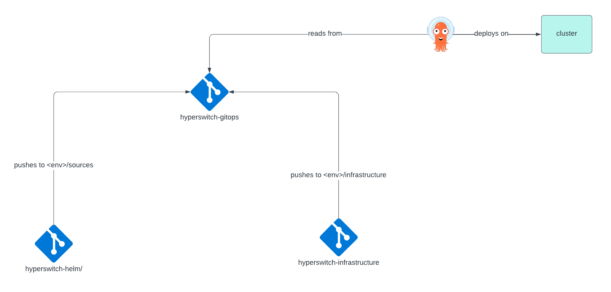
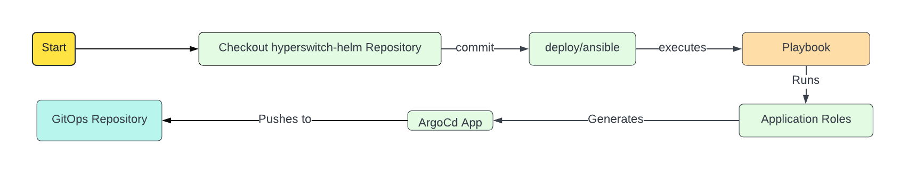
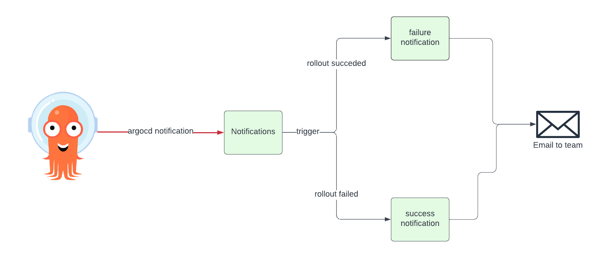

# Proposal for Continuous Deployment pipeline using Argo

## Design Overview

### Git repositories' structure

1. **App Repo**: This repository will contain the application manifests(`hyperswitch-helm`) which will be deployed by Argo CD. The folder structure would look like:
```yaml
charts/ # unchanged
    <contains all helm charts and helm configurations>
deploy/     # contains the logic to generate and push argocd application manifests to gitops repo
    ansible/
        generate-argo-app.yaml
        roles/
            generate_application/
                tasks/
                    main.yaml
                templates/
                    hyperswitch-stack-argo-application.j2
                vars/
                    main.yaml
```
- The [`deploy`](https://github.com/Shubh-k04/hyperswitch-helm/tree/hiring-challenge/deploy/ansible) folder is responsible for generating the Argo CD application manifests and pushing them to the `Argo-CD-Gitops-Repo`. 
- The [`generate-argo-app.yaml`](https://github.com/Shubh-k04/hyperswitch-helm/blob/hiring-challenge/deploy/ansible/generate-argo-app.yaml) is the main playbook which will be executed by the CI/CD pipeline (preferably by a Github Action to prevent any manual intervention). The `generate_application` role is responsible for generating the Argo CD application manifests. 
- The [`templates/`](https://github.com/Shubh-k04/hyperswitch-helm/tree/hiring-challenge/deploy/ansible/roles/generate_application/templates) is the folder which will contain the argocd application manifest and the rollout manifest. 

2. **Infrastructure Repo**: This [repository](https://github.com/Shubh-k04/hyperswitch-infrastructure)(`hyperswitch-infrastructure`) will contain the infrastructure manifests which will be help in deploying:
- Argocd on the cluster.
- Configuring Argo CD with required RBAC permissions (specific to the application and lifecycles).
- Create app of apps pattern for Argo CD for the initial setup.
- Install Argocd CRDs like Notifications, Rollouts etc.

The folder structure would look like:
```yaml
deploy/
    ansible/
        infra_deploy_playbook.yaml # playbook to deploy argocd, enable rbac and create app-of-apps
        roles/
            argocd/
                tasks/
                    main.yaml
                templates/
                    argocd-notifications.j2
                    argocd-rbac.j2
                    app-of-apps.j2
                vars/
                    main.yaml
```
3. **Gitops Repo**: This repository will contain the Argo application manifests which will be deployed by Argo CD. The folder structure would look like:
```yaml
dev/
    sources/
        hyperswitch-stack-argo-application.yaml
        hyperswitch-<app2>-argo-application.yaml # if more applications are to be added to the repo
        hyperswitch-<app3>-argo-application.yaml
        ...
    infrastructure/
        argocd-hyperswitch-project.yaml # contains the project configuration for hyperswitch
        argocd-rbac.yaml # contains the rbac configuration for hyperswitch
        app-of-apps.yaml # contains the app-of-apps configuration for hyperswitch
stage/...
prod/...
```

As per the above structure, the repository contains a lifecycle wise division (dev/stage/prod). Each lifecycle contains two folders:
1. `sources`: This folder contains the application manifests which will be deployed by Argo CD. The application manifests will be generated by the [`deploy`](https://github.com/Shubh-k04/hyperswitch-helm/tree/hiring-challenge/deploy/) folder in the `App Repo`.
2. `infrastructure`: This folder contains the infrastructure manifests which will be deployed by Argo CD. The infrastructure manifests will be generated by the [`deploy`](https://github.com/Shubh-k04/hyperswitch-infrastructure/tree/main/deploy/ansible) folder in the `Infrastructure Repo`.

## Summary

The proposal outlines a Continuous Deployment (CD) pipeline using Argo. It involves three main repositories:

1. **App Repo**: Contains application manifests (`hyperswitch-helm`) and scripts to generate and push Argo CD application manifests to the `Argo-CD-Gitops-Repo`.

2. **Infrastructure Repo**: Houses infrastructure manifests for deploying and configuring Argo CD on the cluster, configuring RBAC permissions, and creating an app-of-apps pattern for Argo CD.

3. **Gitops Repo**: Holds Argo application manifests for deployment by Argo CD, organized by lifecycle (dev/stage/prod) with separate folders for sources (application manifests) and infrastructure manifests.

### Installing and configuring ArgoCD
Assuming we have a fresh cluster on which we want to configure `hyperswitch`:

1. Install ArgoCD and ArgoCD dependencies (notifications, rollouts) on the cluster using `hyperswitch-infrastructure` repository's ansible-playbook. The playbook generates all the templates related to ArgoCD configuration and pushes it to the `hyperswitch-gitops` repo.
2. One of the files the infrastructure repository pushes is an ArgoCD app-of-apps, which points to the `dev/infrastructure` folder in the gitops repository. This app-of-apps creates the `dev-bootstrap-sources`.
3. The `dev-bootstrap-sources` in turn creates all the files present inside the `dev/sources` folder of the gitops repository.
4. *So what pushes to the sources/ folder?* - The application repositories do. One such application, especially in our use case, is `hyperswitch-helm` repository. This repository contains the helm chart and the argocd application and rollout. 
5. The `deploy` folder generates the application and rollout and pushes it to the `hyperswitch-gitops` repo's `dev/sources` folder.

### Configuring Notifications
Now, we have installed ArgoCD and we are assuming that our environment is dev at the moment. Next step is to verify if all applications on argoCD are running without any errors and the development team should be notified in case of any errors. To configure that:

1. We create the notifications based on the sync status and health status of the `hyperswitch-stack-application`
2. We are choosing email notifications, the configurations of the same is done on the cluster already (present in the `hyperswitch-infrastructure` repository)
3. After the mode of notification is setup, we set up how the message in the mail should look like and what should trigger the notification. Both the trigger and template are also installed as a part of the `hyperswitch-infrastructure` application.

## Expected Outcomes

### ArgoCD integration
ArgoCD will contain 2 [app-of-apps](https://github.com/Shubh-k04/hyperswitch-infrastructure/blob/main/deploy/ansible/roles/infra_deploy/templates/app-of-apps-infrastructure.j2) which will be responsible for deploying the application manifests and infrastructure components(like AppProject, MachineSets etc.).
```yaml
---
## Sources App of Apps
apiVersion: argoproj.io/v1alpha1
kind: Application
metadata:
    name: dev-bootstrap-sources
    namespace: "{{ argocd_namespace }}"
spec:
    project: default
    source:
        repoURL: 'https://github.com/Shubh-k04/hyperswitch-gitops.git'
        targetRevision: master
        path: "dev/sources" # path to the application manifests
    destination:
        server: 'https://kubernetes.default.svc'
        namespace: "{{ argocd_namespace }}"
    syncPolicy:
        automated:
        selfHeal: true
        prune: true
---
## Infrastructure App of Apps
apiVersion: argoproj.io/v1alpha1
kind: Application
metadata:
    name: dev-bootstrap-infrastucture 
    namespace: "{{ argocd_namespace }}"
spec:
    project: default
    source:
        repoURL: 'https://github.com/Shubh-k04/hyperswitch-gitops.git'
        targetRevision: master
        path: "dev/infrastructure" # path to the infrastructure manifests
    destination:
        server: 'https://kubernetes.default.svc'
        namespace: "{{ argocd_namespace }}"
    syncPolicy:
        automated:
        selfHeal: true
        prune: true
```
1. This app-of-apps will be act as the primary tool for continuous deployment, ensuring that it is seamlessly integrated into the existing development workflow. As soon as there is a change in the application(helm-chart repo) or infrastructure manifests, the app-of-apps will automatically sync the changes to the cluster.
2. For Argocd to sync applications, we need to add the following annotations to the argocd applications (especially app-of-apps):
```yaml
## Infrastructure App of Apps
apiVersion: argoproj.io/v1alpha1
kind: Application
...
spec:
    ...
    syncPolicy:
        automated:           # This will ensure that the application is automatically synced to the gitops repo
            selfHeal: true 
            prune: true
    ...
```
These annotations will ensure that the application is automatically synced to the gitops repo. And if there are any manual changes made to the cluster, the application will self-heal and/or prune the changes.

Reference: [ArgoCD Sync Policy](https://argoproj.github.io/argo-cd/user-guide/sync-policy/)

### Automation

1. To automate the deployment process, we will use Github Actions. 
    - The Github Actions will be triggered on every push to the `hyperswitch-helm` repository. 
    - The Github Actions will execute the playbook `generate-argo-app.yaml` which will generate the Argo CD application manifests present in the ansible role.
    - The generated argo application is then pushed to the `hyperswitch-gitops` repo (under the `dev/sources` folder).

2. To integrate automated testing:
    - `unittests`: The `unittests` manifest should contain a `PreSync` webhook which will run the unit tests before syncing the application to the cluster. If the unit tests fail, the application will not be synced to the cluster. For eg: there is a pod which should run the unit tests before syncing the application to the cluster. 
    ```yaml
    kind: Pod
    apiVersion: v1
    metadata:
        name: unittests
        namespace: unittest-ns
        annotations:
            argocd.argoproj.io/hook: PreSync    # This will run the unit tests before syncing the application to the cluster
    spec:
        containers:
        - name: unittests
            image: <image>
            command: ["python", "test.py"]
    ```
    - `integration tests`: The `integration tests` should be run after the application is synced to the cluster. The integration tests should be run in a separate pod which will test the application in the cluster. If the integration tests fail, the application will be rolled back to the previous version. For eg: there is a pod which should run the integration tests after syncing the application to the cluster.
    ```yaml
    kind: Pod
    apiVersion: v1
    metadata:
        name: integration-tests
        namespace: integration-ns
        annotations:
            argocd.argoproj.io/hook: PostSync    # This will run the integration tests after syncing the application to the cluster
    ```
    Reference: [ArgoCD hooks](https://argoproj.github.io/argo-cd/user-guide/resource_hooks/)

### Infrastructure as Code (IaC)

1. For IaC leveraging and to define and manage the infrastructure configurations, we have created a separate infrastructure repository `hyperswitch-infrastructure`. This repository will contain everything our cluster would need during the time of build:
    - Machineset configuration
    - DNS entry for ArgoCD server.
    - Deploying ArgoCD.
    - Configuring RBAC (if needed)
    - Generate app-of-apps for infrastructure and applications.
    - Generate the notifications and rollouts configuration for argocd.

2. To store the infrastructure configuration, we are generating all manifests and pushing all templates related to infrastructure to `hyperswitch-gitops` repository (dev/infrastructure folder). Since there will be an ArgoCD Application pointing to the `dev/infrastructure` path, and `targetRevision` is also defined to either the `main` branch, or a custom `release-<version>` branch, it takes care of version-control for infrastructure changes. Similarly, to maintain consistency, we will enable autoSync annotations:
```yaml
## Infrastructure App of Apps
apiVersion: argoproj.io/v1alpha1
kind: Application
...
spec:
    ...
    syncPolicy:
        automated:           # This will ensure that the application is automatically synced to the gitops repo (maintains consistency)
            selfHeal: true 
            prune: true
    ...
```

### Rollout Strategies

1. To track the rollout plan, we can use ArgoCD rollout for the hyperswitch application we created earlier. This argocd Rollout will help us control the pace and impact of application updates, allowing for gradual deployments to specific environments.
This rollout is specific to each application, hence, we've added `hyperswitch-stack-rollout.j2` in the templates. This will get generated and pushed to the gitops repo. 
We have taken a `canary` deployment as we want the updates to be gradual. Similar to:
```yaml
strategy:
    # For a normal rolling update, simply specify the canary strategy without steps defined.
    # The maxSurge and maxUnavailable fields can be specified. If omitted, defaults to 25% and 0
    # respectively.
    canary:
      maxSurge: 1
      maxUnavailable: 1
```
Reference: [ArgoCD Rollouts](https://argo-rollouts.readthedocs.io/en/stable/features/canary/)

2. A reliable rollback mechanism in Argo CD to quickly revert to the previous state in case of deployment issues, is the ArgoCD rollback option provided on the argocd UI. On the click of a button, argocd will revert to the previous commit/state of the deployment hence taking care of the issue. 
If we don't want the change to be done by the UI, ArgoCD rollouts can be used to rollback the change as well. And since we've already configured ArgoCD Rollouts, what it will do is:
- We try deploying a new version N+1, but it fails
- ArgoCD Rollouts will switch the traffic back to version N and be in a degraded state (since it's 
not upto the desired version)
- The automatic rollback does not make any changes in the gitops repo.
- The cluster will be healthy with running version N of hyperswitch, but the hyperswitch Application and Rollout will be degraded because it won't be pointing to the new version N+1

### Environment Configuration

1. To accomodate environment specific configurations, we can use a combination of ansible and ArgoCD helm values. Ansible templates help us provide the conditions based on the envrionment provided. For eg:
```yaml
kind: Application
...
source:
    helm:
      values: |
        env: {{ env }}
        ## USING AN EXAMPLE ENVIRONMENT CONFIGURATION
        
        image: "redis:7.3"
        
        image: "redis:7.4"
        
        image: "redis:7.2"
        
```
As we can see here, we can configure the configurations to the helm chart based on the environment provided. And after the playbook executes, it will push the environment specific configurations to the ArgoCD application. Hence making it possible to use environment specific configurations.

**NOTE: Assumption is that env, stage and prod all have different ArgoCD deployed**

### Notifications and Reporting

1. To enable notifications, we are installing `ArgoCD Notification` via `hyperswitch-infrastructure`. Then we have setup a email notification configuration looks something like:

```yaml
# argocd-notifications-secret secret
apiVersion: v1
kind: Secret
metadata:
  name: argocd-notifications-secret
stringData:
  email-username: <myemail@gmail.com>
  email-password: hidden_password
type: Opaque
```
- The notifications about the argocd applications will be sent to the email id: `myemail@gmail.com`
- Reference: [ArgoCD notifications](https://argocd-notifications.readthedocs.io/en/stable/services/email/)

2. Once we have set up the notifications, we are setting up the `Triggers` and `templates` to send out the notifications on success/failure of rollouts. 
- Set up a template to contain all the information the message notification should contain
    ```yaml
    apiVersion: v1
    kind: ConfigMap
    metadata:
    name: argocd-notifications-cm
    data:
    # Define a custom template for email notifications
    template.hyperswitch-template: |
        message: |
        {{- if eq .app.status.sync.status "Succeeded" }}
        # If the application sync is successful
        Application {{.app.metadata.name}} sync succeeded.
        Success Rate: {{.app.status.sync.successRate}}
        Deployment Duration: {{.app.status.sync.duration}}
        Application details: {{.context.argocdUrl}}/applications/{{.app.metadata.name}}
        
        {{- else}}
        # If the application sync failed
        Application {{.app.metadata.name}} sync failed.
        Failure Rate: {{.app.status.sync.failureRate}}
        Deployment Duration: {{.app.status.sync.duration}}
        Application details: {{.context.argocdUrl}}/applications/{{.app.metadata.name}}
        {{- end }}
    ```
- Add a  trigger to the same to trigger the message on the provided condition (we are ensuring that the message goes only once in a syncRevision cycle and not very frequently to spam)
    ```yaml
    ...
    data:
        # Define a trigger for when the sync status is su
        - when: app.status.operationState.phase in ['Succeeded'] and app.status.health.status == 'Healthy'
          oncePer: app.status.sync.revision
          send: [hyperswitch-template]       # Template names to be used for successful sync
        # Define a trigger for when the sync status is failed
        - when: app.status.operationState.phase not in ['Succeeded'] # Trigger condition for failed sync
          send: [my-custom-template-slack-template]       # Template names to be used for failed sync
          oncePer: app.status.sync.revision
    ```
The trigger & the notification setup helps us in setting up and notifying the team about the application's status and other requirements mentioned in the problem statement.

Reference: [ArgoCD Triggers](https://argocd-notifications.readthedocs.io/en/stable/triggers/)